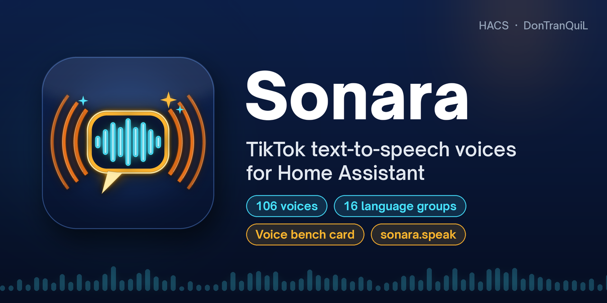
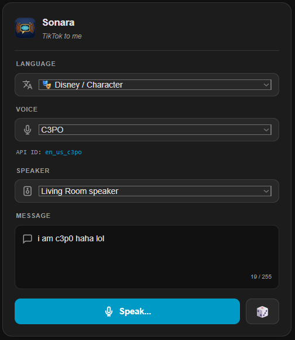

<div align="center">



<br>

**A cast of 106 TikTok voices for your house — narrators, characters and singing voices, with a dashboard voice bench.**

[](https://my.home-assistant.io/redirect/hacs_repository/?owner=DonTranQuiL&repository=sonara&category=integration)

[](https://github.com/DonTranQuiL/sonara/releases)
[](https://hacs.xyz)
[](https://www.home-assistant.io/)
[](LICENSE)
[](https://github.com/DonTranQuiL/sonara/releases)

[](https://github.com/DonTranQuiL/sonara/actions/workflows/pytest.yml)
[](https://github.com/DonTranQuiL/sonara/actions/workflows/hass-ci.yml)
[](https://github.com/DonTranQuiL/sonara/actions/workflows/hassfest.yaml)
[](https://github.com/DonTranQuiL/sonara/actions/workflows/hacs.yaml)
[](https://github.com/DonTranQuiL/sonara/actions/workflows/codeql.yml)
[](https://github.com/astral-sh/ruff)
[](https://discord.gg/qaHPTTKHae)
[](https://ko-fi.com/DonTranQuiL)

[Install](#installation) · [Voices](#voices) · [Card](#lovelace-card) · [Services](#services) · [Examples](#automation-examples) · [Docs site](https://dontranquil.github.io/sonara/)

</div>

Sonara is a Home Assistant text-to-speech (TTS) integration for TikTok's voices. It gives you a regular `tts.*` entity you can use in any automation, plus a ready-made Lovelace card to pick a language and voice, type a line and play it on any media player.

Sonara is the rebranded continuation of the TikTok TTS integration by Philipp Lüttecke and Steven Fox (see [Credits](#credits)). It is unofficial and not affiliated with or endorsed by TikTok or ByteDance.

## Highlights

| | |
| --- | --- |
| 🎙️ **106 voices, 16 language groups** | Narrators, characters (C3PO, Stormtrooper, Ghostface…), singing voices and 12 languages |
| 🎛️ **Voice bench card** | Pick language, voice and speaker, type a line, press Speak — registered automatically |
| ⚡ **`sonara.speak`** | One call: message, players, optional voice. Works with `random` too |
| 🌐 **No account needed** | Community proxy by default; direct mode with your own session if you prefer |
| 🧩 **Plays nice with HA** | Standard `tts.*` entity, one tidy device, diagnostics, repairs, translations |

## Features

- **106 voices in 16 language groups**: US/UK/Australian English, character voices, singing voices, French, Italian, Spanish (ES/MX), German, Portuguese (BR/PT), Indonesian, Japanese, Korean and Vietnamese
- **Two connection modes**
  - **Community proxy** (recommended): no account needed, uses the open-source proxy by [Weilbyte](https://github.com/Weilbyte/tiktok-tts). You can self-host it.
  - **Direct**: talks to TikTok's own (unofficial) speech API with your browser `sessionid` cookie and falls back across regional endpoints automatically
- **Live connection test** in the setup and options screens, so a bad URL or expired session is caught before saving
- **Standard TTS entity** (`tts.sonara_proxy` / `tts.sonara_direct`) with per-call voice override and per-language voice lists
- **Random voice**: pass `voice: random` and Sonara picks a voice from your chosen language pool (saved across restarts)
- **Lovelace voice bench** (`custom:sonara-card`), registered automatically
- **Shared helper entities** for dashboards and scripts: language, voice, output device, message and a Speak button
- **Long messages** are split on sentence and word boundaries in direct mode and joined back into one clip
- **Retries and fallback**: 2 retries per request, then the other regional endpoints (direct mode)
- **Repair issue** when TikTok rejects your session cookie in direct mode
- **`sonara.speak` service**: one call to speak on one or more players, with an optional per-call voice and connection
- **Diagnostics** download with the session cookie redacted
- Options changes apply on save, no restart needed

## How it works

| Mode | Request | Account | Notes |
| --- | --- | --- | --- |
| Community proxy | `POST {endpoint}/api/generation` with `{"text", "voice"}` | None | The proxy handles long texts. Health check: `GET {endpoint}/api/status`. Default: `https://tiktok-tts.weilnet.workers.dev` |
| Direct | `POST {endpoint}/media/api/text/speech/invoke/` | TikTok `sessionid` cookie | Max ~200 characters per request, so Sonara chunks long text. Unofficial API: it can change at any time and **may violate TikTok's Terms of Service**. Use at your own risk. |

Both modes return MP3 audio to Home Assistant's TTS pipeline, so Home Assistant's normal TTS caching applies.

You can add one proxy entry and one direct entry at the same time. The helper entities and the card are shared between them.

## Voices

106 voices in 16 groups. Use the code in `options: voice:` or `sonara.speak`; the card shows each voice's code as **API ID**.

| Group | Voices | Examples (code) |
| --- | ---: | --- |
| 🇺🇸 English (US) | 24 | Jessie (`en_us_001`, default), Story Teller (`en_male_narration`), Granny (`en_female_grandma`), Santa (`en_male_santa`) |
| 🇬🇧 English (UK) | 8 | Narrator (`en_uk_001`), Alfred (`en_male_jarvis`), Mr. Meticulous (`en_male_ukbutler`) |
| 🇦🇺 English (AU) | 2 | Metro (`en_au_001`), Smooth (`en_au_002`) |
| 🎭 Disney / Character | 9 | C3PO (`en_us_c3po`), Stormtrooper (`en_us_stormtrooper`), Scream (`en_us_ghostface`), Stitch (`en_us_stitch`) |
| 🎵 Music / Singing | 15 | Caroler (`en_male_sing_deep_jingle`), Opera (`en_female_ht_f08_halloween`), Pop Lullaby (`en_female_f08_twinkle`) |
| 🇫🇷 French | 2 | `fr_001`, `fr_002` |
| 🇮🇹 Italian | 1 | `it_male_m18` |
| 🇪🇸 Spanish | 4 | Alejandra (`es_female_f6`), Mariana (`es_female_fp1`) |
| 🇲🇽 Spanish (Mexico) | 2 | Álex (`es_mx_002`), Super Mamá (`es_mx_female_supermom`) |
| 🇩🇪 German | 2 | `de_001` (female), `de_002` (male) |
| 🇧🇷 Portuguese (Brazil) | 5 | Ivete Sangalo (`bp_female_ivete`), Júlia (`br_003`) |
| 🇵🇹 Portuguese (Portugal) | 3 | Laizza (`pt_female_laizza`), Galvão Bueno (`pt_male_bueno`) |
| 🇮🇩 Indonesian | 4 | Icha (`id_female_icha`), Darma (`id_male_darma`) |
| 🇯🇵 Japanese | 20 | Miho (`jp_001`), Keiko (`jp_003`), Sakura (`jp_005`) |
| 🇰🇷 Korean | 3 | `kr_002`, `kr_003`, `kr_004` |
| 🇻🇳 Vietnamese | 2 | `BV074_streaming` (female), `BV075_streaming` (male) |

The full list lives in [`const.py`](custom_components/sonara/const.py) (`VOICES_BY_LANGUAGE` and `VOICE_NAMES`). Pass `voice: random` to pick from the language groups you chose with `sonara.set_random_voices` (or the 🎲 button on the card).

## Installation

### HACS (recommended)

1. HACS → ⋮ → **Custom repositories** → add `https://github.com/DonTranQuiL/sonara` as an **Integration**.
2. Search for **Sonara** and download it.
3. Restart Home Assistant.
4. **Settings → Devices & services → Add integration → Sonara**.

### Manual

1. Download the latest release and copy `custom_components/sonara` into `config/custom_components/`.
2. Restart Home Assistant.
3. **Settings → Devices & services → Add integration → Sonara**.

## Configuration

The setup wizard asks for a connection mode first.

**Community proxy**

| Field | Default | Description |
| --- | --- | --- |
| Proxy endpoint URL | `https://tiktok-tts.weilnet.workers.dev` | Must start with `http://` or `https://`. Use your own instance for better reliability. |
| Default voice | `en_us_001` | Voice used when an automation doesn't pass one. |

**Direct**

| Field | Default | Description |
| --- | --- | --- |
| API endpoint | `https://api16-normal-c-useast1a.tiktokv.com` | Tried first. The other known regional endpoints are used as fallback. |
| Session ID | — | The value of the `sessionid` cookie from a logged-in TikTok browser session (F12 → Application → Cookies). It expires; Sonara raises a repair issue when it does. |
| Default voice | `en_us_001` | Voice used when an automation doesn't pass one. |

Change any of these later with **Configure** on the integration card.

## Entities

| Entity | Type | What it does |
| --- | --- | --- |
| `tts.sonara_proxy` / `tts.sonara_direct` | TTS | The speech engine for that config entry |
| `select.sonara_language` | Select | Language group (plus **All Languages** and **Random Voice**) |
| `select.sonara_voice` | Select | Voice in the selected group. The raw voice code is in the `code` attribute |
| `select.sonara_device` | Select | Media player to speak on. Updates when players come and go |
| `text.sonara_message` | Text | The line to speak (restored after restart) |
| `button.sonara_speak` | Button | Speaks the message with the selected voice on the selected device |

Everything is grouped under one **Sonara** service device per connection (manufacturer DonTranQuiL, model *TikTok TTS (proxy)* or *(direct)*), so the integration page shows the entry as **Sonara (Proxy)** / **Sonara (Direct)** with one device. On the device page the Message and Speak entities are under *Controls* and the Language, Voice and Device selects under *Configuration*.

The TTS entities are created per config entry. The select, text and button entities exist once, however many entries you add, and sit on the device of the first entry.

## Services

### `sonara.set_random_voices`

Sets which language groups the random voice picks from. The card calls this for you.

```yaml
action: sonara.set_random_voices
data:
  languages: [en_us, en_uk, music]
```

Codes: `en_us`, `en_uk`, `en_au`, `disney` (characters), `music` (singing), `fr`, `it`, `es`, `es_mx`, `de`, `pt_br`, `pt_pt`, `id`, `ja`, `ko`, `vi`. An empty list clears the pool.

### `sonara.speak`

Speaks a message without having to look up the TTS entity. Sonara picks the loaded connection (proxy first, like the Speak button) and calls `tts.speak` for you.

| Field | Required | Description |
| --- | --- | --- |
| `message` | yes | Text to speak |
| `media_player_entity_id` | yes | One or more media players |
| `voice` | no | Voice code for this message only, or `random`. Empty = the default voice from the config entry |
| `engine` | no | `proxy` or `direct`. Empty = proxy if loaded, else direct |
| `cache` | no | Let Home Assistant cache the audio. Default on, off for `random` |

```yaml
action: sonara.speak
data:
  message: "Dinner is ready."
  media_player_entity_id:
    - media_player.kitchen
    - media_player.living_room
  voice: en_male_narration
```

It raises a clear error when the message is empty or the requested connection isn't loaded.

## Diagnostics

**Settings → Devices & services → Sonara → ⋮ → Download diagnostics** gives you the version, connection mode, entry data with the session cookie redacted, the random-voice pool and the state of the Sonara entities. The message text itself is not included. Attach it to bug reports.

## Lovelace card

The card is a voice bench: pick a language, a voice and a speaker, type a line and press **Speak**. It uses the Sonara entities automatically, so it needs no options.

<p align="center"></p>

### Add the card

Edit a dashboard → **Add card** → search for **Sonara**, or use a **Manual** card with exactly this YAML:

```yaml
type: custom:sonara-card
```

That is the whole card config. There are no entity options: the card always uses `select.sonara_language`, `select.sonara_voice`, `select.sonara_device`, `text.sonara_message` and `button.sonara_speak`.

### The dashboard resource (automatic — not card config)

Sonara also registers the card's JavaScript as a dashboard **resource**. You can see it under **Settings → Dashboards → ⋮ → Resources**:

| URL | Resource type |
| --- | --- |
| `/sonara/sonara-card.js?v=<version>` | JavaScript module (`type: module`) |

`type: module` is correct here: it tells the browser how to load the JavaScript file. It is **not** a card. Don't paste it into the card editor, and don't change it to anything else.

Only if your dashboards are in **YAML mode** do you add the resource yourself, in `configuration.yaml` (not in a card):

```yaml
lovelace:
  resources:
    - url: /sonara/sonara-card.js
      type: module
```

### Card troubleshooting

- **"Custom element doesn't exist: sonara-card"** right after installing or updating: hard-refresh the browser (Ctrl+Shift+R / Cmd+Shift+R) or clear the app's frontend cache in the Companion app (Settings → Companion app → Debugging → Reset frontend cache).
- **"Unknown type encountered: module"** (or similar): the resource YAML was pasted into the card editor. Replace the card YAML with `type: custom:sonara-card`.
- Check that **Settings → Dashboards → ⋮ → Resources** has one `/sonara/sonara-card.js` entry of type *JavaScript module*. If it's missing, restart Home Assistant and Sonara adds it again.
- Coming from TikTok TTS? Delete any leftover `/tiktoktts/tiktoktts-card.js` resource there; that file no longer exists.

## Automation examples

Announce with a specific voice:

```yaml
action: tts.speak
target:
  entity_id: tts.sonara_proxy
data:
  media_player_entity_id: media_player.kitchen
  message: "The washing machine is done."
  options:
    voice: en_us_ghostface
```

Random voice from your pool:

```yaml
action: tts.speak
target:
  entity_id: tts.sonara_proxy
data:
  media_player_entity_id: media_player.living_room
  message: "Someone is at the door."
  options:
    voice: random
```

Speak whatever is in the dashboard fields:

```yaml
action: button.press
target:
  entity_id: button.sonara_speak
```

## Migrating from TikTok TTS (`tiktoktts`)

Sonara uses a new domain (`sonara`), so Home Assistant treats it as a different integration. There is no automatic migration:

1. Remove the old **TikTok TTS** integration and its `custom_components/tiktoktts` folder.
2. Install Sonara and add it again (your proxy URL or session ID is not carried over).
3. Update dashboards and automations:
   - `custom:tiktoktts-card` → `custom:sonara-card`
   - `tts.tiktoktts_proxy` / `tts.tiktoktts_direct` → `tts.sonara_proxy` / `tts.sonara_direct`
   - `select.tiktoktts_*`, `text.tiktoktts_message`, `button.tiktoktts_speak` → `select.sonara_*`, `text.sonara_message`, `button.sonara_speak`
   - `tiktoktts.set_random_voices` → `sonara.set_random_voices`
4. If the old card resource `/tiktoktts/tiktoktts-card.js` is still listed under **Settings → Dashboards → Resources**, delete it.

Voice codes did not change.

## Troubleshooting

- **"Could not connect" / timeout during setup**: the public proxy is sometimes down or rate limited. Try again later or self-host [Weilbyte's proxy](https://github.com/Weilbyte/tiktok-tts) and enter its URL.
- **"The endpoint responded but reports it is currently unavailable"**: the proxy's `/api/status` says it is not available right now.
- **Direct mode stops speaking / repair issue "Direct API session expired"**: copy a fresh `sessionid` cookie and paste it under **Configure**.
- **Sounds like the default voice**: the voice code isn't recognised and TikTok falls back to its default voice.
- **Card not found or shows an error**: see [Card troubleshooting](#card-troubleshooting).
- **Debug logging**:

```yaml
logger:
  logs:
    custom_components.sonara: debug
```

## Docs

Project docs: [dontranquil.github.io/sonara](https://dontranquil.github.io/sonara/)

## Credits

- **Philipp Lüttecke** ([@philipp-luettecke](https://github.com/philipp-luettecke/tiktoktts)): original TikTok TTS integration for Home Assistant
- **Steven Fox** ([@sfox38](https://github.com/sfox38)): extended fork that Sonara is based on (version 1.2.2)
- **Weilbyte** ([tiktok-tts](https://github.com/Weilbyte/tiktok-tts)): community TTS proxy
- **oscie57** ([tiktok-voice](https://github.com/oscie57/tiktok-voice)): voice list reference
- **DonTranQuiL**: Sonara rebrand and maintenance

## Disclaimer

Unofficial. Not affiliated with, endorsed by or connected to TikTok or ByteDance. "TikTok" is a trademark of its owner and is used here only to describe what the integration talks to. Direct mode uses an undocumented API and your own session cookie, which may violate TikTok's Terms of Service. Use at your own risk.

## Support

- Issues: [GitHub Issues](https://github.com/DonTranQuiL/sonara/issues)
- Community: [Discord](https://discord.gg/qaHPTTKHae)
- Tip jar: [Ko-fi](https://ko-fi.com/DonTranQuiL)

## License

MIT — see [LICENSE](LICENSE) and [NOTICE](NOTICE.md). The original MIT copyright notice is kept.
